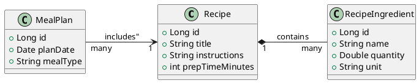

```plantuml
@startuml
left to right direction
class Recipe {
    +Long id
    +String title
    +String instructions
    +int prepTimeMinutes
}

class RecipeIngredient {
    +Long id
    +String name
    +Double quantity
    +String unit
}

class MealPlan {
    +Long id
    +Date planDate
    +String mealType
}

Recipe "1" *-- "many" RecipeIngredient : contains
MealPlan "many" --> "1" Recipe : includes"
@enduml
```