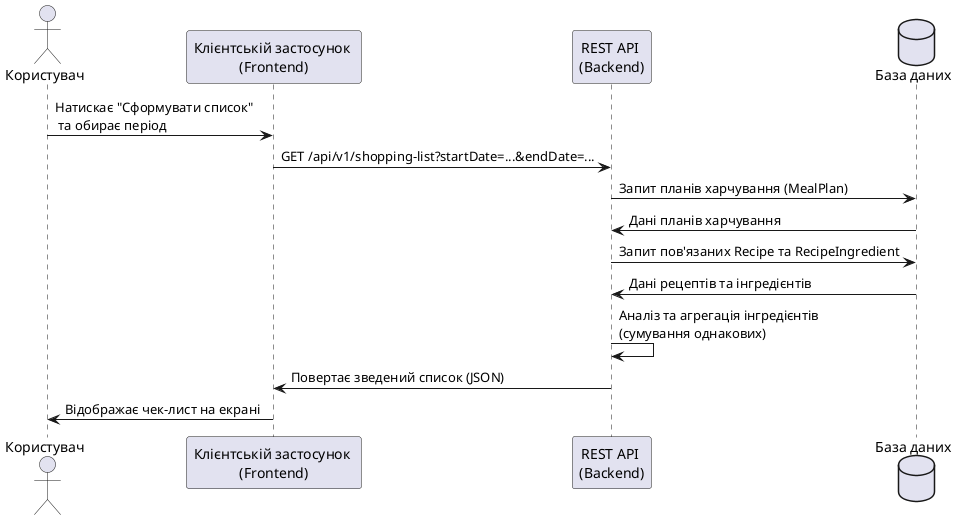

```plantuml
@startuml
actor "Користувач" as User
participant "Клієнтській застосунок \n(Frontend)" as Frontend
participant "REST API \n(Backend)" as API
database "База даних" as DB

User -> Frontend: Натискає "Сформувати список" \n та обирає період
Frontend -> API: GET /api/v1/shopping-list?startDate=...&endDate=...
API -> DB: Запит планів харчування (MealPlan)
DB -> API: Дані планів харчування
API -> DB: Запит пов'язаних Recipe та RecipeIngredient
DB -> API: Дані рецептів та інгредієнтів
API -> API: Аналіз та агрегація інгредієнтів\n(сумування однакових)
API -> Frontend: Повертає зведений список (JSON)
Frontend -> User: Відображає чек-лист на екрані
@enduml
```