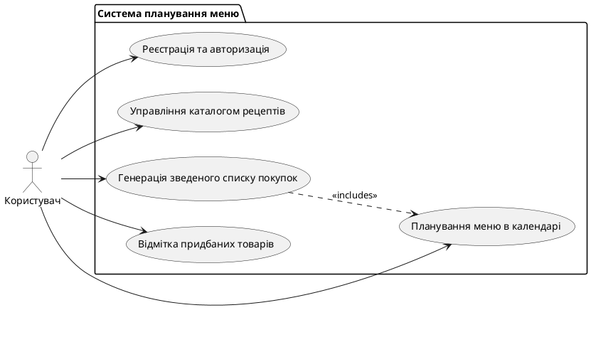

```plantuml
@startuml
left to right direction
actor "Користувач" as User

package "Система планування меню" {
    usecase "Реєстрація та авторизація" as UC1
    usecase "Управління каталогом рецептів" as UC2
    usecase "Планування меню в календарі" as UC3
    usecase "Генерація зведеного списку покупок" as UC4
    usecase "Відмітка придбаних товарів" as UC5
}

User --> UC1
User --> UC2
User --> UC3
User --> UC4
User --> UC5

UC4 ..> UC3 : <<includes>>
@enduml
```
